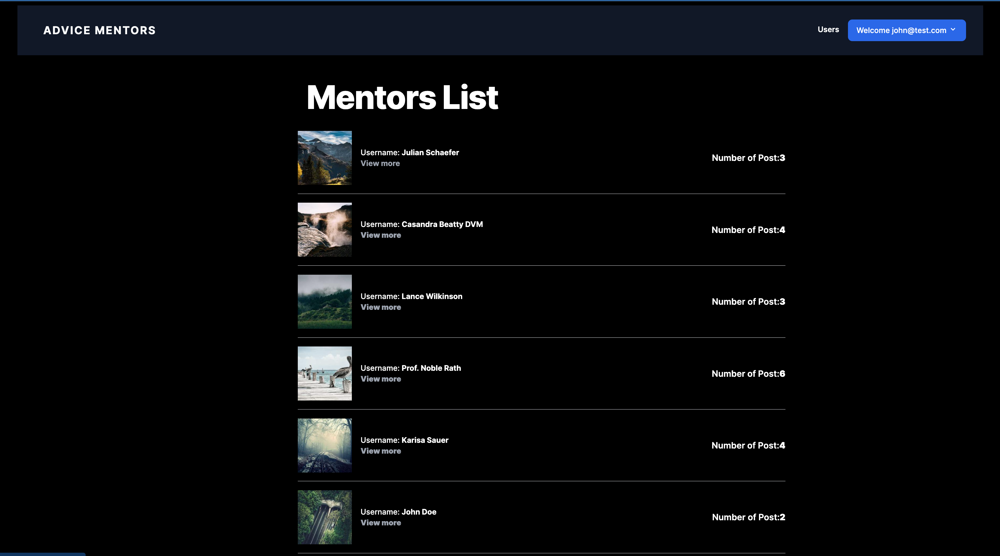

# Advise Mentors



> The Advise Mentors is a classic example of a blog website. We created a fully functional website that show the list of posts and empower readers to interact with them by adding comments and liking posts

## Built With

* Ruby on Rails
* Rubocop, Stylint
* Rspec

## Perquisites

 - Ruby version 2.7 or higher
 - Rails 7
 - yarn
 - Node.js

## Live link

[Website Live link](https://nana-ama.herokuapp.com/)

## Preview Video

[Video Walk through](https://www.loom.com/share/5463d533e60a4596a1ac70c89ecbfe36)

## Getting Started 🙌

To get a local copy up and running follow these simple example steps.

- Copy and paste the following commands into your terminal to get everything up and running
  ```
  git clone https://github.com/learnwithalfred/advise_mentors
  cd advise_mentors
  bundle install
  yarn install
  rails db:create
  rails db:migrate
  bin/dev

👤 **Alfred Boateng**

- GitHub: [@learnwithalfred](https://github.com/learnwithalfred)
- Twitter: [@kb_alfred](https://twitter.com/kb_alfred)
- LinkedIn: [@learnwithalfred](https://www.linkedin.com/in/learnwithalfred/)


## 🤝 Contributing

Contributions, issues, and feature requests are welcome!

Feel free to check the [issues page](../../issues/).

## Show your support

Give a ⭐️ if you like this project!

## Acknowledgments

- Hat tip to anyone whose code was used
- Inspiration
- etc

## 📝 License

This project is [MIT](./MIT.md) licensed.
